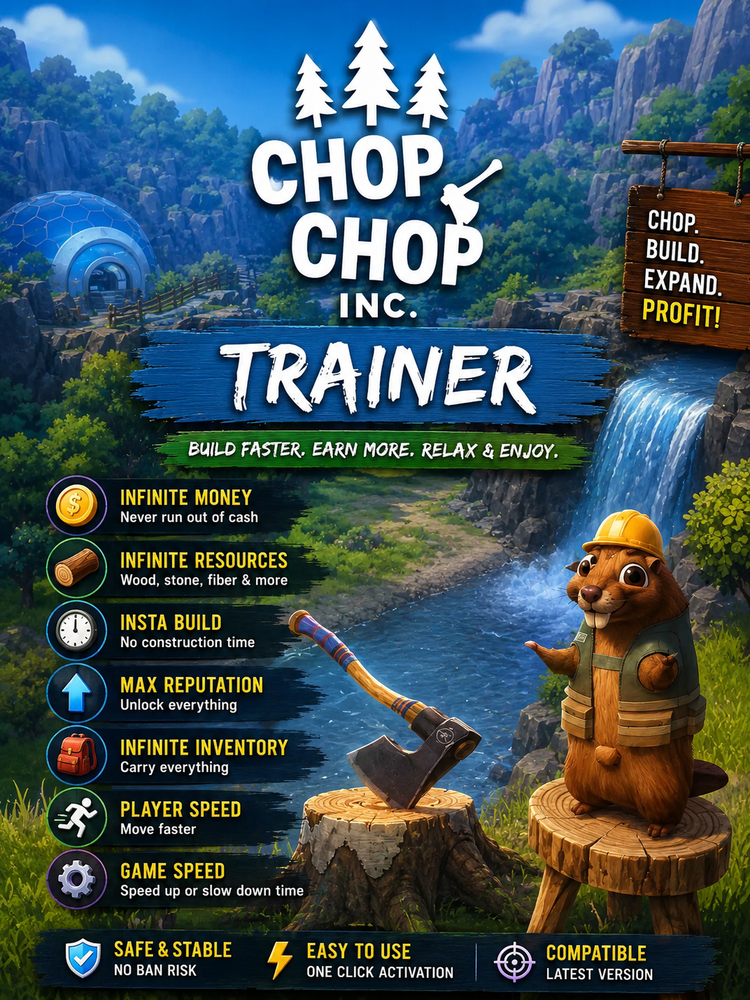
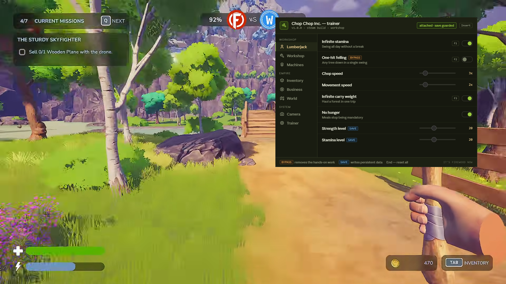

# Chop Chop Inc. Trainer — Mod Menu & Cheats for PC (v1.0.0)

**Chop Chop Inc. trainer** with an in-game **mod menu** aimed squarely at the late-game grind: infinite resources, infinite money, auto-harvest every tree type, scale down those hundred-item orders, unlock all blueprints, machines that never jam. Plus a rolling save backup and a guard on the New Game button, because the game currently ships with one autosave slot and no confirmation prompt. Works with the **Steam** release from NullRef Entertainment and rokaplay. Open the overlay with `Insert`, flip a toggle, get back to chopping.

> **[⬇ Download the latest Chop Chop Inc. trainer](https://github.com/FlockPatronPray/Chop-Chop-Inc-Trainer/releases/latest)**

    

---

## Contents

- [What this is](#what-this-is)
- [The save problem](#the-save-problem)
- [The late-game grind](#the-late-game-grind)
- [Bypass and save tags](#bypass-and-save-tags)
- [Compatibility](#compatibility)
- [Features](#features)
  - [Lumberjack](#lumberjack--player-cheats) · [Workshop](#workshop--crafting-cheats) · [Machines](#machines--automation-cheats) · [Inventory](#inventory--resources) · [Business](#business--money-and-orders) · [World](#world--exploration) · [Camera](#camera--photo-mode-options) · [Trainer](#trainer-options)
- [Hotkeys](#hotkeys)
- [Installation](#installation)
- [How to use the mod menu](#how-to-use-the-mod-menu)
- [Troubleshooting](#troubleshooting)
- [FAQ](#faq)
- [Changelog](#changelog)
- [Disclaimer](#disclaimer)

---

## What this is

*Chop Chop Inc.* is a first-person job sim about getting laid off by Furnox Corp and building a furniture empire out of spite. Logs become planks, planks become furniture, furniture becomes profit — and unlike most games in this genre, you physically assemble the thing you're making, which is the bit reviewers keep singling out as the reason it's fun rather than tedious.

It's also a game with a very steep back half. The opening hours move fast; the late game asks for hundreds of components across multiple tree species, while auto-harvest only covers one species and runs slowly. That's the gap this trainer is built for.

Two things here aren't cheats at all: a **rolling save backup** and a **guard on the New Game button**. See below for why.

---

## The save problem

As of the launch build, Chop Chop Inc. has a single autosave slot and no confirmation prompt on New Game. Players have reported losing multi-hour runs by clicking the wrong menu item once.

Two options in the Trainer tab address this directly, and both are **on by default**:

- **Guard the New Game button** — inserts a confirmation step before a new save can overwrite an existing one.
- **Rolling save backup** — copies your save on an interval you set, into slots the game doesn't give you. Default is every 10 minutes.

Use them even if you never touch a single cheat. Turn on read-only mode, leave these two enabled, and the trainer works as a save-safety tool and nothing else.

This is a game-side issue and the developers may well fix it. Check the game's patch notes before assuming you still need the guard.

---

## The late-game grind

The most common complaint about this game is the shape of its back half: requests that need hundreds of items, spread across tree species that auto-harvest doesn't cover, at a harvesting rate that doesn't scale with the ask.

Three options target that specifically, and they're worth knowing about even if you'd rather not cheat generally:

- **Order requirements** (Business tab) — a percentage slider on how much an order actually asks for. Set it to `40%` and a 300-item request becomes 120. The order still exists, you still fulfil it, it just stops being a spreadsheet.
- **Auto-harvest every tree type** (Machines tab) — lifts the one-species restriction.
- **Auto-harvest speed** (Machines tab) — up to 20x.

Between them you can keep the whole production chain intact and just remove the padding.

---

## Bypass and save tags

Two tags appear next to option names in the menu.

**`bypass`** — this option removes hands-on work. **One-hit felling** and **Instant assembly** are the two that matter. The assembly step in particular is the thing people praise about this game, so switching it off is a real trade. Both are off by default.

**`save`** — this option writes persistent data: strength and stamina levels, unlocked blueprints, machines, regions, customer groups, machine slots. Anything tagged this way survives a reload and can be invalidated by a patch. Let the rolling backup run before you touch them.

Everything untagged is runtime-only friction removal — resources, money, stamina, machine speed, carry weight.

---

## Compatibility

| | |
|---|---|
| **Game** | Chop Chop Inc. (NullRef Entertainment / rokaplay, released 7 August 2026) |
| **Store** | Steam |
| **OS** | Windows 10 and Windows 11, 64-bit |
| **Runtime** | .NET Desktop Runtime 8 or newer, DirectX 11 |
| **Display** | The game supports 16:10 and wider only — 5:4 and 4:3 aren't supported, and the overlay follows the game's aspect ratio |
| **Storage** | The game requires an SSD; the trainer doesn't care |
| **Demo build** | Not supported, the demo runs on a separate app ID |
| **Steam Deck / Proton** | Not supported |

---

## Features

    

60+ options across eight tabs, grouped into **Workshop**, **Empire** and **System**. Sliders show the shipped default.

### Lumberjack — player cheats

| Option | What it does | Hotkey | Tag |
|---|---|---|---|
| **Infinite stamina** | Swing all day without a break | `F1` | — |
| **One-hit felling** | Any tree down in a single swing | `F2` | bypass |
| **Chop speed** | `1x`–`20x`, default `3x` | — | — |
| **Movement speed** | `1x`–`10x`, default `2x` | — | — |
| **Infinite carry weight** | Haul a forest in one trip | `F3` | — |
| **No hunger** | Meals stop being mandatory | — | — |
| **Strength level** | `1`–`50`, default `20` | — | save |
| **Stamina level** | `1`–`50`, default `20` | — | save |

**Infinite carry weight** removes more tedium per click than anything else in the trainer. The walk between the tree line and the workshop is the real early-game cost, and hauling one load instead of six changes the pace completely.

You can still bench press your way to better woodworking if you'd rather earn the stat levels — the sliders are there for people who've already done it once.

### Workshop — crafting cheats

| Option | What it does | Hotkey | Tag |
|---|---|---|---|
| **Instant processing** | Logs to planks with no wait | `F4` | — |
| **Instant assembly** | The piece builds itself | — | bypass |
| **Perfect assembly** | Every joint aligns first try | — | — |
| **No material loss** | Nothing wasted on a bad cut | — | — |
| **Craft without materials** | Build from an empty inventory | — | — |
| **Unlock all blueprints** | Every furniture, prop and tool | — | save |
| **Craft speed** | `1x`–`20x`, default `3x` | — | — |

Note the gap between **Perfect assembly** and **Instant assembly**. The first removes the punishment for a misaligned joint — you still put the piece together. The second skips the whole thing. Only one of them is tagged, and it's the one that deletes the best part of the game.

### Machines — automation cheats

| Option | What it does | Hotkey | Tag |
|---|---|---|---|
| **Machines never jam** | No breakdowns, no unattended disasters | `F5` | — |
| **Machine speed** | `1x`–`20x`, default `5x` | — | — |
| **No power or fuel drain** | — | — | — |
| **Auto-harvest every tree type** | Not just the one the game allows | `F6` | — |
| **Auto-harvest speed** | `1x`–`20x`, default `5x` | — | — |
| **Unlimited machine slots** | — | — | save |
| **Unlock all machines** | — | — | save |
| **No machine wear** | — | — | — |

### Inventory — resources

| Option | What it does | Hotkey |
|---|---|---|
| **Infinite resources** | Wood, metal, stone, tech, all of it | `F7` |
| **Unlimited storage** | Crates never fill up | — |
| **Resource multiplier** | `1x`–`50x`, default `5x` | — |
| **Freeze item counts** | Nothing depletes as you build | — |
| **Bought components are free** | The shop stops charging | — |
| **Instant restock** | Vendors refill immediately | — |
| **Stack size** | `10`–`999`, default `999` | — |

### Business — money and orders

| Option | What it does | Hotkey | Tag |
|---|---|---|---|
| **Infinite money** | — | `F8` | — |
| **Money multiplier** | `1x`–`50x`, default `3x` | — | — |
| **Instant delivery to the city** | No transport wait | — | — |
| **Orders never expire** | — | — | — |
| **Order requirements** | `1%`–`100%`, default `100%` | — | — |
| **Reputation always maximum** | — | — | — |
| **Unlock all customer groups** | — | — | save |

**Order requirements** is the most useful slider in the trainer and the one worth setting rather than maxing. At `100%` the game is unchanged. At `40%` the late game becomes reasonable. At `1%` there's nothing left to do.

### World — exploration

| Option | What it does | Hotkey | Tag |
|---|---|---|---|
| **Teleport to waypoint** | Jump to the marker on the map | `F9` | — |
| **Trees respawn instantly** | The forest grows back as fast as you cut | — | — |
| **Instant mine regeneration** | Ore and gems return at once | — | — |
| **Reveal the full map** | — | — | — |
| **Unlock all regions** | Every biome and tree species | — | save |
| **Highlight resources and secrets** | `20`–`400 m`, default `150 m` | — | — |
| **Noclip and fly** | Walk through world geometry | `F10` | — |

The world is handcrafted and full of hidden things — a well that does something, a false wall in the mine, oddities the community is still working out. **Highlight resources and secrets** will spoil some of that. Turn it off for a first run if you'd rather find them.

### Camera & photo mode options

| Option | What it does | Hotkey |
|---|---|---|
| **Field of view** | `60`–`120 deg`, default `90 deg` | — |
| **Free camera** | Detach it from the character | `F11` |
| **Hide interface** | Drop the HUD and all prompts | `F12` |
| **Third-person view** | Step outside first person | — |
| **Disable depth of field** | — | — |
| **Disable motion blur** | — | — |
| **Time of day** | Any hour, default `15:00` | — |
| **Extended photo mode** | Filters, angles, timescale | — |

### Trainer options

| Option | What it does |
|---|---|
| **Guard the New Game button** | Confirm before a new save overwrites — **on by default** |
| **Rolling save backup** | Extra slots the game doesn't give you — **on by default** |
| **Backup interval** | `1`–`60 min`, default `10 min` |
| **Hotkeys** | Global bindings on or off |
| **Menu key** | Rebind the overlay — `Insert`, `F1`, `Home`, `~` |
| **Overlay opacity** | `40%`–`100%`, default `92%` |
| **Block achievement unlocks** | Keep a cheated run off your profile — the game has 21 |
| **Auto-load profile** | Apply the saved set on launch |

---

## Hotkeys

| Key | Action |
|---|---|
| `Insert` | Open or close the mod menu |
| `F1` | Infinite stamina |
| `F2` | One-hit felling |
| `F3` | Infinite carry weight |
| `F4` | Instant processing |
| `F5` | Machines never jam |
| `F6` | Auto-harvest every tree type |
| `F7` | Infinite resources |
| `F8` | Infinite money |
| `F9` | Teleport to waypoint |
| `F10` | Noclip and fly |
| `F11` | Free camera |
| `F12` | Hide interface |
| `End` | Reset every option |
| `↑ ↓ ← → Enter` | Navigate the menu without a mouse |

---

## Installation

1. **Download** the latest archive from the [Releases page](https://github.com/FlockPatronPray/Chop-Chop-Inc-Trainer/releases/latest).
2. **Unblock it** — right-click the `.zip`, choose Properties, tick *Unblock*, then Apply. Windows quarantines downloaded archives and the trainer won't attach otherwise.
3. **Extract** anywhere outside `Program Files`.
4. **Launch the game first** and load your save, so the process exists.
5. **Run the trainer as administrator.** The header should read `attached` with the save guard active.
6. **Press `Insert`.**

Save data typically sits under `%USERPROFILE%\AppData\LocalLow` in the developer's folder — check your install for the exact path, since it can differ between builds. Turn off Steam Cloud for the game while you experiment so a bad local write doesn't sync upward.

---

## How to use the mod menu

Pick a tab on the left, flip what you need on the right. Sliders update live.

A few setups worth knowing:

- **Save safety only, no cheating:** `Guard the New Game button` + `Rolling save backup` + `Read-only mode`. The trainer writes nothing to the game and just stops you losing your run.
- **Fix the late game, keep the game:** `Order requirements 40%` + `Auto-harvest every tree type` + `Auto-harvest speed 10x` + `Infinite carry weight`. Full production chain intact, padding gone.
- **Comfortable early game:** `Infinite stamina` + `Infinite carry weight` + `No hunger` + `Movement speed 3x`. Nothing tagged.
- **Second playthrough:** `One-hit felling` + `Instant assembly` + `Infinite resources`. You've built the furniture; now you want the world and the secrets.
- **Screenshots:** `Hide interface` + `Free camera` + `Third-person view` + `Time of day 15:00`.

---

## Troubleshooting

**I lost my save to the New Game button.** If the rolling backup was running, your copies are in the trainer's backup folder — restore the newest one. If it wasn't, this is the reason it ships enabled.

**Trainer says the process wasn't found.** The game has to be running with a save loaded. Launch Chop Chop Inc., load your workshop, then start the trainer.

**Nothing happens when I press Insert.** Another overlay is eating the key. Steam's overlay, Discord and RTSS are the usual suspects. Rebind under **Trainer → Menu key**.

**The overlay is cut off or misaligned.** The game only supports 16:10 and wider. On an unsupported aspect ratio the game itself renders incorrectly and the overlay inherits that.

**Machine options do nothing.** Machine memory is allocated per placed machine. Place at least one, then toggle.

**Auto-harvest still only covers one tree type.** Toggle it off and on after loading into a region — the option binds when the region's harvest table is loaded, not at attach time.

**My unlocks disappeared after an update.** `save`-tagged options write persistent data that a patch can invalidate. Restore a rolling backup from before the update.

**Windows Defender flagged it.** Trainers read and write another process's memory, which is what a lot of malware also does, so heuristic scanners flag them on principle. Add an exclusion if you're comfortable with that — and if you'd rather not, don't. That's a reasonable call.

---

## FAQ

### Will I get banned for using cheats in Chop Chop Inc.?

It's a single-player game with no anti-cheat and no multiplayer, so there's nothing to be banned from. The 21 achievements unlock locally unless you block them in the Trainer tab.

### Can this stop me losing my save?

That's what **Guard the New Game button** and **Rolling save backup** are for, and both are on by default. You can run the trainer in read-only mode and use it purely as a save-safety tool.

### How do I fix the late-game grind?

**Order requirements** in the Business tab is the direct answer — a percentage slider on how much each request asks for. Pair it with **Auto-harvest every tree type** and **Auto-harvest speed**.

### Can I auto-harvest more than one tree type?

Yes, in the Machines tab. The base game restricts auto-harvest to a single species; this lifts that.

### Does it skip the assembly minigame?

Only if you turn on **Instant assembly**, which is tagged `bypass` and off by default. Physically assembling the furniture is what most reviews single out as the best part.

### Can I get infinite money and resources?

Yes — **Infinite money** in the Business tab, **Infinite resources** in the Inventory tab, plus multipliers for both.

### Does it work on Steam Deck or Linux?

No. Windows only. Proton changes how the game's memory is laid out.

### Does it work on the demo?

No. The demo is a separate app ID and isn't supported.

### Will it corrupt my save?

`save`-tagged options write persistent data — stat levels, blueprints, machines, regions, customer groups. That's exactly why the rolling backup exists. Everything else is runtime-only and leaves nothing behind.

### How do I turn everything off?

Press `End`.

---

## Changelog

### v1.0.0 — 11 August 2026

First public release. 60+ options across Lumberjack, Workshop, Machines, Inventory, Business, World, Camera and Trainer. Save guard and rolling backup enabled by default; order requirements exposed as a percentage slider rather than an on/off cheat.

Full history on the [Releases page](https://github.com/FlockPatronPray/Chop-Chop-Inc-Trainer/releases).

---

## Disclaimer

Unofficial fan tool. **Not affiliated with, endorsed by, or connected to NullRef Entertainment, rokaplay or Valve.** *Chop Chop Inc.* and all related names and assets belong to their respective owners.

Intended for single-player use on your own copy. Modifying a running game's memory carries some risk of crashes and save corruption — let the rolling backup run, and use it at your own risk.

Released under the [MIT License](LICENSE).

---

Chop Chop Inc. trainer · Chop Chop Inc. cheats · Chop Chop Inc. mod menu for PC · infinite money, infinite resources, auto-harvest all tree types, reduce order requirements, unlock all blueprints, save backup · Steam · NullRef Entertainment and rokaplay · furniture and lumberjack simulator
